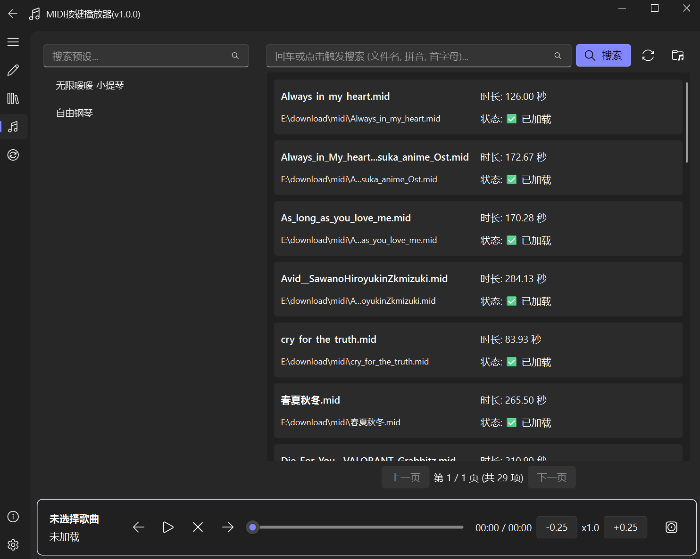

# midi-player

> 一个解析midi文件映射到按键输入的游戏演奏播放器

# 概述

**midi-player** 可以 **高时钟精度** 地将midi演奏音符转化为按键映射，让你的游戏人物能准确演奏出想听的曲目。[项目](https://github.com/fanfanffy163/midi-player)仍在持续开发更新中。

查看[用户手册](/zh-cn/guide.md)了解详细使用方法

# 特性

- 支持 **多种按键预设** 以支持不同场景
- 可以导出、导入分享按键预设
- **智能调音** 支持游戏内低音域乐器
- 自由选择 **指定音轨** 进行演奏
- 支持识别五线乐谱直接生成midi文件
- 支持加减速、自由调节播放进度、自定义按键控制音乐播放
- 基于[PySide6-Fluent-Widgets](https://qfluentwidgets.com/)、[PySide6](https://wiki.qt.io/Qt_for_Python)的QT GUI界面，支持自定义主题切换