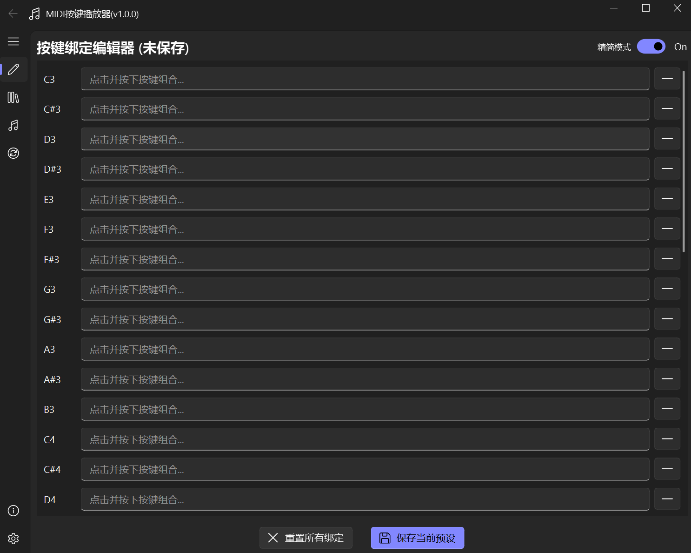
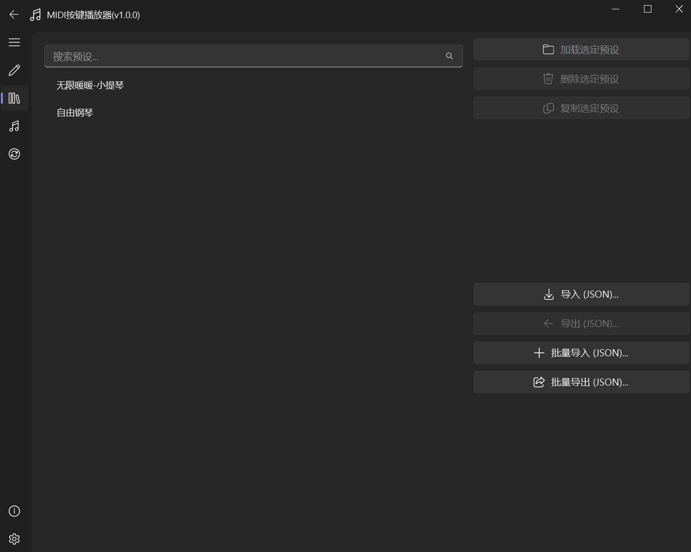
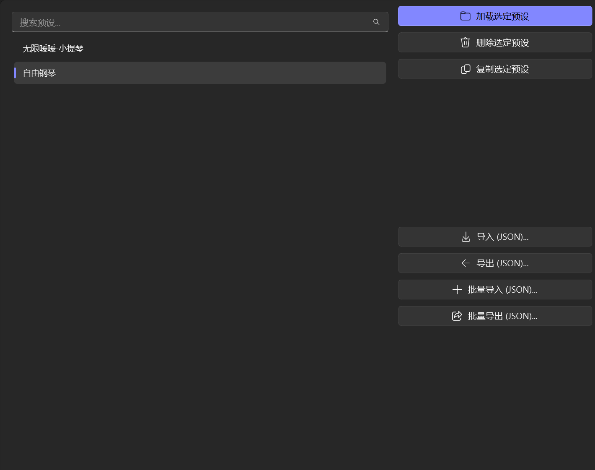
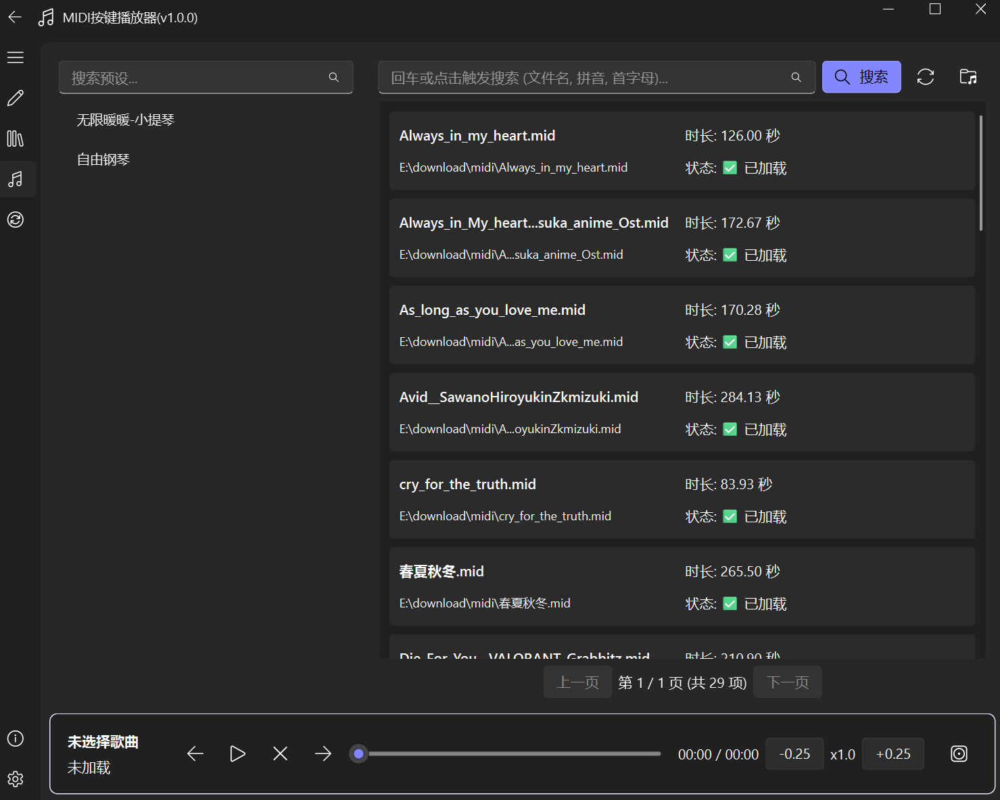
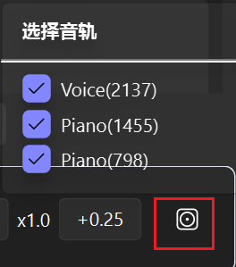
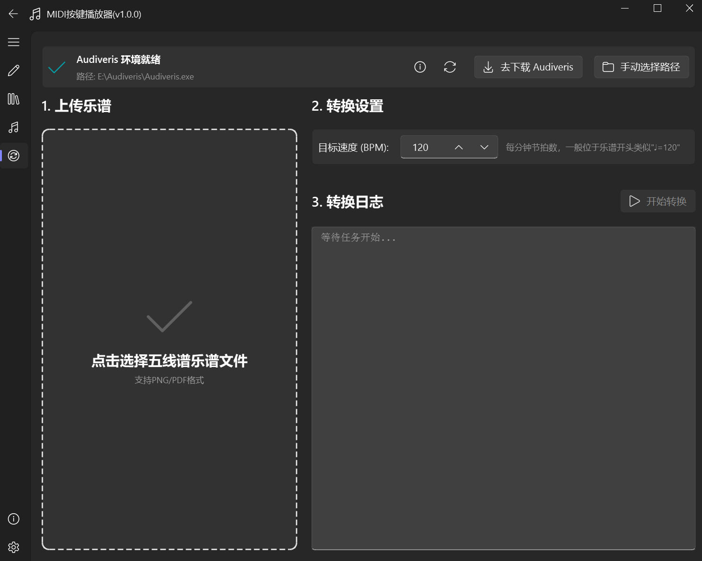

# 🎹 使用教程

## 1. 按键绑定 (Key Binding)

### 核心操作
  
* **绑定按键**：点击音符对应的“绑定器”，按下键盘按键（支持组合键，如 `Ctrl+A`），抬起按键即自动保存。

### 辅助功能
  
**清除绑定**：点击右侧的 **`-`** 号标志，即可快速清除当前已设定的预设

  
**模式切换**：点击切换按钮，可在 **精简** 与 **完整** 模式间切换。
* 🎹 **精简模式**：C3 - B5
* 🎹 **完整模式**：C0 - B8

 

## 2. 预设管理 (Preset)

此界面用于管理所有的按键映射方案。

### 列表与导入
 

* **导入**：导入他人分享的单条预设文件。
* **批量导入**：导入他人打包的预设包。
* **批量导出**：将你设置的所有预设备份到一个文件中。

### 预设编辑
当你在列表中 **选中** 某条预设时，将激活右侧操作栏：

* 🚀 **加载选定预设**：立即应用该方案到[按键绑定](#_1-按键绑定-key-binding)界面。
* 🗑️ **删除**：移除该预设。
* 📋 **复制**：创建该预设的副本。
* 📤 **导出**：将此单条预设导出分享。

 

## 3. 音乐播放 (Player)

选中左侧的 **预设** 和右侧的 **Midi文件** 后，点击播放即可。

### 功能亮点
* **控制台**：支持调速、切歌 (上一首/下一首)、拖动进度条。
* **轨道控制**：支持手动勾选需要播放的音轨。
* **快速搜索**：支持 **拼音** 或 **文件名** 全文搜索。

?> **💡 提示：** 可以在 [设置] 中修改 Midi 源文件的文件夹路径。 当文件夹内容变动时，点击搜索栏右侧的 **刷新按钮** 🔄 重建索引（APP 重启时也会自动刷新）。

#### 音轨选择
  

## 4. 乐谱转 MIDI (OMR)

!> **前置条件：** 使用此功能需预先安装 [Audiveris](https://github.com/Audiveris/audiveris)。

**工作原理：**
Audiveris 是一款开源 OMR (光得乐谱识别) 软件，可识别图片/PDF格式的乐谱并生成 [MusicXML](https://www.musicxml.com/)。

**处理流程：**
